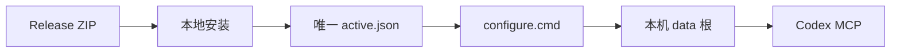

# KnowledgeRadar

[English](README.en.md) · [Release](https://github.com/ga626/knowledge-radar/releases) · [首次成功](docs/FIRST_SUCCESS.md) · [支持](SUPPORT.md)

  

**让 Codex 和其他本地 Agent 通过一个 MCP 服务使用网页、学术资料、中文内容平台与招聘信息。**

KnowledgeRadar 是 Windows 优先、local-first 的 MCP 产品：代码从 GitHub 下载，API Key、登录态、浏览器 Profile、缓存、任务数据和日志始终保留在你的电脑。它不是云服务，也不会代替你绕过验证码、付费墙或第三方账号限制。

> Alpha 阶段：核心网页研究可以先用；平台登录、额度和部分可选能力会明确显示“需要人工操作”或“预期降级”，不会伪装为成功。

## 它适合什么

- 在 Windows 上使用 Codex 或其他 MCP 客户端，希望统一调用搜索、网页提取、研究路线和本机健康检查。
- 希望按需启用学术、视频、多模态、中文平台或招聘能力，而不是一次性配置全部服务。
- 希望自己的 Key、Cookie、浏览器资料和结果不离开本机。

不适合：需要托管 SaaS、自动管理第三方账户，或要求绕过网站安全/访问限制的场景。

## 第一次使用：四步

1. 从 [Release](https://github.com/ga626/knowledge-radar/releases) 下载同一版本的 `KnowledgeRadar.zip`、`KnowledgeRadar-…-SHA256SUMS.txt` 和 `candidate-receipt.json`，先核对 ZIP SHA-256。
2. 安装 Python 3.12，在解压目录运行：

   ```bat
   python scripts\product_install.py apply --channel stable --archive KnowledgeRadar.zip --receipt candidate-receipt.json
   ```

3. 运行安装器生成的 `configure.cmd`。它只启动 `127.0.0.1` 页面，并只写入稳定产品的数据根；已填项目不会回显，留空不会清除已有配置。
4. 按 Codex 的方式重启/刷新后，在 Codex 调用 `health_check`，再调用 `get_capabilities`。预期能看到本机状态和当前工具面；未配置的可选能力会说明下一步，而不是泄露配置值。

完整的首次成功、升级和回滚说明见 [首次成功](docs/FIRST_SUCCESS.md) 与 [产品安装与更新](docs/PRODUCT_INSTALL.md)。



## 会改变什么，不会碰什么

| 项目 | 行为 |
| --- | --- |
| Codex 配置 | 仅维护一个 `mcp_servers.knowledgeradar` block，并在写入前备份原配置。 |
| 程序更新 | 新版本安装在版本化 app/runtime 目录；`active.json` 永远只指向一个稳定版本。 |
| 你的数据 | Key、Profile、缓存、日志和任务状态放在独立 data 根；升级不覆盖，rollback 不删除。 |
| 外部服务 | 只有你填写并实际调用的 Provider 才会被使用；不会自动发起付费调用或登录。 |
| 发布内容 | 不含真实 Key、Cookie、账户、浏览器 Profile、数据库、日志、媒体缓存或个人路径。 |

## 能力包与边界

| 能力 | 先决条件 | 失败时的产品行为 |
| --- | --- | --- |
| 核心网页研究 | 配置任一网页搜索来源即可增强；未配也会如实报告 | 不把缺 Provider 说成搜索成功 |
| 学术与公开视频 | 按需配置 Provider | 显示额度、网络或开放访问边界 |
| 中文内容平台 / 招聘 | 可能需要登录或人工验证 | 报告 `NEEDS_INTERACTION` / 降级，不绕过验证 |
| 多模态 | 由你配置模型与预算 | 不会默认产生付费模型调用 |

页面中的能力包和健康摘要均为脱敏状态；它只会隔离 manifest 已登记且过期的媒体缓存，不会清理密钥、Profile 或日志。细节见 [能力包](docs/CAPABILITY_PACKS.md) 与 [隐私和本地状态](docs/PRIVACY_AND_LOCAL_STATE.md)。

## 三种入口，避免走错路径

| 你是谁 | 应从哪里开始 |
| --- | --- |
| 普通 Release 用户 | 本页的四步与 [首次成功](docs/FIRST_SUCCESS.md)；不要运行 `install.bat`、`start.cmd` 或 pytest。 |
| 源码开发者 | [开发者指南](docs/DEVELOPER.md)；可使用 `.env`、源码向导、HTTP 调试和测试。 |
| 维护者 | [Release Candidate](docs/RELEASE_CANDIDATE.md)；必须从干净 public checkout 的同一候选 artifact 发布。 |

## 获取帮助与参与

- 遇到安装、配置或运行问题：先看 [支持](SUPPORT.md) 和 [FAQ](docs/FAQ.md)，再用对应 Issue 模板提交**脱敏**信息。
- 希望贡献：阅读 [贡献指南](CONTRIBUTING.md) 与 [行为准则](CODE_OF_CONDUCT.md)。
- 发现安全或隐私问题：不要公开 Issue，按 [安全政策](SECURITY.md) 私下报告。
- 版本变化：查看 [CHANGELOG](CHANGELOG.md)。

## 许可

[MIT License](LICENSE)。使用第三方平台能力时，请同时遵守其条款、robots 规则和适用法律。
