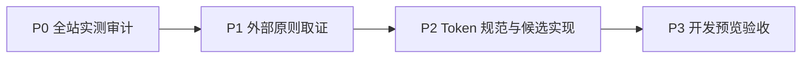

# KnowledgeRadar 前端视觉与排版规范

> 适用范围：本地控制台的控制台、能力中心、本地组件、数据与恢复、设置与帮助。
>
> 状态：开发候选规范；本次仅用于开发预览 `http://127.0.0.1:18883/`，不代表稳定安装版更新。

## 目标与边界

这套规范让 KnowledgeRadar 保持“可信、安静、可读的深色研究控制台”气质：雷达承担态势感知，列表与配置承担决策和操作。视觉不应用来伪造任务、状态或数据量。

规范不改变真实数据、API Key、账号流程、任务语义或稳定安装版。任何新增页面先复用本规范；除非有明确的可访问性或产品理由，不新增第二套颜色、字号、圆角和动画体系。

## 规范建立路线

## 详细执行步骤

### Step 1 / P0：全站实测审计

- 做什么：读取控制台五个导航页的实际计算样式、布局、焦点和动效。
- 怎么做：在开发预览逐页采样标题、正文、标签、按钮、卡片和雷达组件；归并不受角色约束的字号、颜色和动效。
- 输入：当前开发候选 `console_page.py` 与 `18883` 页面。
- 输出：字体碎片化、硬编码颜色、重复 CSS 与动效不一致的审计结论。
- 验收：每个用户可见页面都有明确的排版、颜色和交互问题归类。
- 依赖与边界：只读审计；不触及稳定安装、API 或账号。

### Step 2 / P1：外部原则取证

- 做什么：确定对比度、非文字状态、减弱动效和 token 架构的底线。
- 怎么做：通过 KnowledgeRadar 原生 MCP 对 W3C WCAG 2.2 与 Fluent 2 官方页面作正文抽取，记录回执与适用范围。
- 输入：P0 的问题分类与官方正文。
- 输出：可访问性下限及“原始 token + 语义 token”的实现原则。
- 验收：每项高重要性原则均有正文抽取回执；不把搜索摘要当作结论。
- 依赖与边界：不把外部组件库视觉直接移植到 KnowledgeRadar。

### Step 3 / P2：Token 规范与候选实现

- 做什么：将审计与外部原则转成有限的字体、色彩、间距、圆角、边框与动效 token，并覆盖所有控制台页。
- 怎么做：在 `DESIGN_SYSTEM_STYLE` 集中定义 token；组件只消费角色 token；保留已确认的雷达信息布局与真实交互。
- 输入：P0/P1 结论、现有页面结构。
- 输出：本规范、evidence sidecar 与候选 CSS。
- 验收：关键文本不再使用 10px/11px，按钮/卡片/导航统一字号、焦点、边界和动效。
- 依赖与边界：仅改开发候选，不发布、不安装、不覆盖稳定版。
- 是否改代码：稳定版否；开发候选只改 `console_page.py` 的样式合约，不改数据、API、账号、任务语义或安装身份。

### Step 4 / P3：开发预览验收

- 做什么：重启并检查仅开发预览 `18883` 的实际页面。
- 怎么做：执行定向 Python 测试；在 1280px 与 390px 浏览五页并检查加载、控制台、焦点、裁切、动效与交互。
- 输入：P2 候选源码。
- 输出：可刷新验收的开发预览与验证记录。
- 验收：无相关控制台错误、无页面裁切/横向溢出，至少一个真实交互可用。
- 依赖与边界：稳定入口 `18882` 不参与候选验收。

## Token 架构

CSS 使用两层 token：原始 token 保存色值、尺寸和时间；语义 token 说明用途。组件只能消费语义 token，禁止为某一个组件新增近似的 `#hex`、`rgba()`、像素字号或缓动值。

| 类别 | 语义 token / 值 | 用途 |
| --- | --- | --- |
| 画布 | `--bg-canvas #07131f` | 应用最外层背景 |
| 侧栏 | `--bg-sidebar #081826` | 导航与品牌区 |
| 表面 | `--surface-1/#0c2233`、`--surface-2/#102b3f`、`--surface-raised/#12334a` | 默认卡片、分层面、可操作面 |
| 边界 | `--border-subtle`、`--border-strong` | 统一 1px 卡片/控件边框 |
| 文本 | `--text-primary/#eaf7ff`、`--text-secondary/#b5cedc`、`--text-muted/#84a9bd` | 主要内容、辅助正文、元数据 |
| 状态 | `--accent-cyan`、`--accent-blue`、`--success`、`--warning`、`--danger` | 交互焦点与语义状态；状态必须同时有文字或图标 |
| 几何 | 4px 基准；4/8/12/16/20/24/32/40/48px | 间距；圆角仅 10（控件）/14（卡片）/18（Hero） |
| 动效 | 140/200/280ms，`cubic-bezier(.2,.8,.2,1)` | 即时反馈/常规过渡/抽屉与视图过渡 |

## 字体与排版

- UI 字体：`Inter, "Microsoft YaHei", "PingFang SC", system-ui, sans-serif`。
- 技术字段只可使用等宽字体：工具 ID、短状态码、刻度；不得将正文或操作文案设为等宽。
- 正常桌面字号只使用下表角色。`10px` 仅可用于不承载关键信息的装饰刻度；不可用于状态、说明、按钮或配置提示。

| 角色 | 字号 / 行高 / 字重 | 使用位置 |
| --- | --- | --- |
| Display | 36 / 40 / 700 | 雷达中心或极少数主状态 |
| Page title | 30 / 38 / 700 | 页面标题 |
| Section title | 20 / 28 / 700 | 抽屉与大分区标题 |
| Card title | 16 / 24 / 650–700 | 卡片、任务列、能力组标题 |
| Body | 15 / 24 / 400 | 主要说明文字 |
| Body compact | 13 / 20 / 400 | 列表、卡片说明、按钮 |
| Label / Meta | 12 / 16 / 500–700 | 标签、状态、时间、技术元数据 |

移动端仅缩小 Display 到 32/36、Page title 到 26/34、Section title 到 18/26；Body、Label、Meta 不低于桌面值。

## 布局与组件

- 内容页宽最大 1440px；桌面页边距使用 `clamp(24px, 2.5vw, 40px)`；区块间距 24 或 32px。
- 常规卡片内边距 20px，密集列表 16px，雷达/大面板 24px。不可通过嵌套卡片制造无意义边框。
- 导航行至少 44px；按钮至少 40px；所有可键盘操作控件使用同一 2px cyan focus ring 与 2px offset。
- 主按钮、普通按钮、危险/警告按钮只在语义色上不同，文字一律 Body compact（13/20/700）。
- 状态色只指示语义，不承担唯一信息；必须能从文案、图标或结构中读懂状态。

## 雷达与动效

- 雷达背景保持黑蓝观察窗；网格、扫描臂和回波是同一体系的不同亮度层，不把未扫描网格做成高亮装饰。
- 扫描臂是唯一允许持续运动的识别动效。回波为一个柔光点加一层环，尺寸与颜色按语义分级；生成时必须在安全边界内采样，不能贴边、重叠或被卡片裁掉。
- Hover 只允许边界/背景变化及 1px 位移；禁止同屏卡片大幅悬浮、跳动或多层发光竞争注意力。
- `prefers-reduced-motion: reduce` 下，页面转场、扫描、回波、hover 位移全部静止或压缩为一次即时状态变化。

## 对比度与验收

1. 普通文本对背景目标不低于 4.5:1；大文字最低 3:1，但本产品默认仍以 4.5:1 作为更稳妥目标。
2. 有意义的控件边界、图标和状态图形与相邻背景不低于 3:1。
3. 每次 UI 变更须在 1280px 与 390px 检查：无裁切、重叠、横向溢出、不可读小字、无焦点环、缺失状态文案或不受控动画。
4. 用浏览器检查所有五个导航页的初始加载、控制台错误/警告和至少一个真实可点击交互；仅构建通过不算 UI 验收。

## 本轮落地

- 在 `src/onboarding/console_page.py` 建立 `DESIGN_SYSTEM_STYLE`，由它统一覆盖应用壳、导航、标题、面板、按钮、雷达状态卡、任务列、能力中心、抽屉、表单及响应式样式。
- 现有雷达页面专属结构保留；新增样式不得绕过 token。
- 后续应逐步将旧的页面专属硬编码迁移到 token，而不是继续叠加新的 CSS 字符串。

## 外部依据与适用结论

1. [W3C WCAG 2.2 — Contrast (Minimum)](https://www.w3.org/WAI/WCAG22/Understanding/contrast-minimum.html)：普通文本最低 4.5:1，大文本最低 3:1；因此本规范禁止以 10px/11px 淡色文字承载关键信息。
2. [W3C WCAG 2.2 — Non-text Contrast](https://www.w3.org/WAI/WCAG22/Understanding/non-text-contrast.html)：有意义的控件与图形的相邻对比最低 3:1；因此统一了边框、图标、状态与 focus ring。
3. [W3C WCAG 2.2 — Animation from Interactions](https://www.w3.org/WAI/WCAG22/Understanding/animation-from-interactions.html)：非必要动效应可被关闭；因此使用 `prefers-reduced-motion` 同时覆盖 CSS 与雷达动效。
4. [Fluent 2 Design Tokens](https://fluent2.microsoft.design/design-tokens)：将颜色、字体、间距、圆角、描边与动效分为原始与语义 token；因此采用“原始值 + 语义用途”的 token 架构，而不是直接照搬其视觉风格。

研究记录见同名 `.evidence.json`。外部资料提供可访问性与设计系统原则；具体色值、密度和雷达语言来自 KnowledgeRadar 当前已确认的产品方向。
